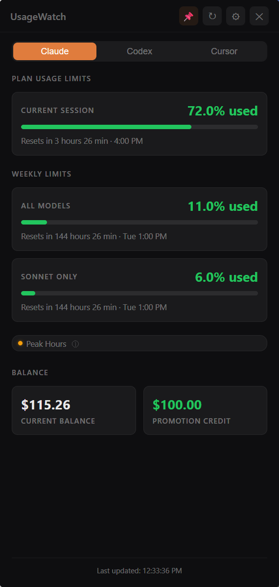
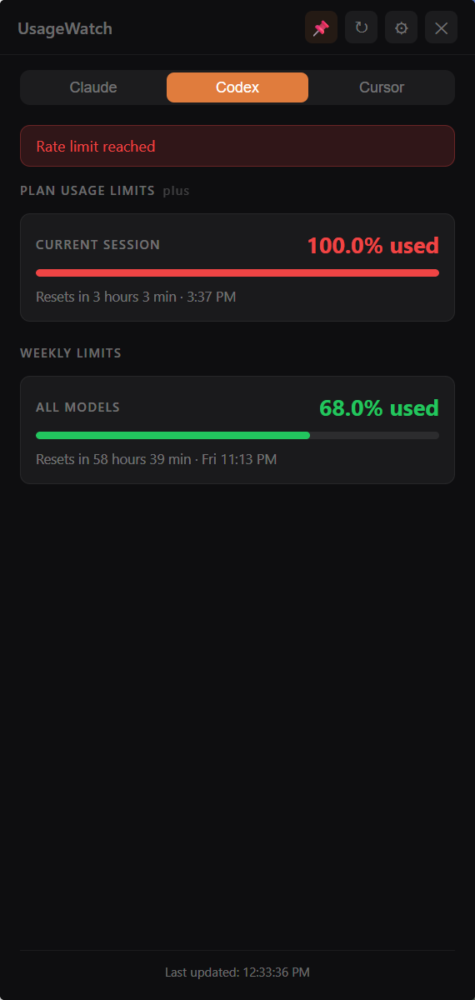

# UsageWatch

A native desktop app that tracks your AI usage limits across **Claude**, **Codex (OpenAI)**, and **Cursor** in one place. Built with Tauri 2, React, and TypeScript, it lives in your system tray and gives you a constant read on rate limits, resets, and spend — so you never get caught off guard mid-session.

<p align="center">
  
  &nbsp;&nbsp;
  
</p>

## Highlights

- **Unified monitoring** — session windows, weekly limits, per-model breakdowns, billing, and live reset countdowns across three providers
- **Context-aware switching** — the menu bar and desktop widget automatically switch providers based on your focused app (macOS + Windows)
- **Always-on-top widget** — transparent desktop overlay showing usage, limits, and reset countdowns with 6 visual themes
- **Menu bar display** — styled usage percentages and reset countdowns rendered directly in the macOS menu bar or Windows system tray
- **Customizable alerts** — native notifications for session/weekly thresholds, burn rate warnings, and limit reset events
- **MCP server** — lets any LLM or AI assistant query your live usage data (Claude Code, Cursor, or any MCP-compatible client)
- **Automation-ready** — local HTTP API on port 52700 plus a Stream Deck plugin for hardware integration
- **Zero-config auth** — auto-detects credentials from 10+ browsers, desktop apps, and OAuth sources

## Monitoring

Each provider is polled on a shared background loop and the results are surfaced across tray, widget, and API simultaneously.

- **Claude** — 5-hour session and 7-day weekly rate-limit windows, per-model breakdowns (Opus, Sonnet, Haiku), prepaid credits, overage grants, bundles, and peak/off-peak status
- **Codex** — session and weekly rate limits, code review window, credit balance, and plan type
- **Cursor** — plan spend vs included amount, on-demand and API usage, team pooled budgets, bonus credits, Stripe prepaid balance, and billing cycle dates
- **Cross-provider** — burn rate calculations (estimated minutes to limit), 7-day usage history stored in local SQLite with an interactive chart

## Desktop Widget

An always-on-top transparent overlay that floats above your desktop showing usage percentages, limits, and live reset countdowns for each provider. Cards are click-through so they never block your work — only the header is draggable.

Six themes: **rainmeter-stack**, **gauge-tower**, **side-rail**, **mono-ticker**, **signal-deck**, and **matrix-rain**. Each supports three density levels (ultra-compact, compact, comfortable) and configurable scale. Cards can be drag-reordered and toggled per-provider.

## System Tray

Three display modes:

- **Static** — always shows one provider
- **Dynamic** — auto-switches based on the frontmost app, with configurable app-to-provider mappings and optional window-title pattern matching
- **Multi-segment** — renders data from multiple providers side-by-side with per-segment color (macOS)

All modes use styled text rendered directly in the tray — no browser tab needed.

## Integrations

### Local HTTP API

UsageWatch serves cached provider snapshots on `http://127.0.0.1:52700`:

| Endpoint | Method | Description |
|----------|--------|-------------|
| `/api/usage` | GET | Claude usage data |
| `/api/codex` | GET | Codex usage data |
| `/api/cursor` | GET | Cursor usage data |
| `/api/billing` | GET | Claude billing (prepaid credits, promotion credit, bundles) |
| `/api/open` | POST | Show/focus the main window |

The local API server is **off by default**. To enable it, go to **Settings > General > Enable local API server** and restart the app. The MCP server and Stream Deck plugin both require this to be enabled.

### MCP Server

The built-in MCP server lets any LLM or AI assistant query your usage data in real time — Claude Code, Cursor, or any MCP-compatible client. It connects to the local HTTP API, so the API server must be enabled (see above).

| Tool | Description |
|------|-------------|
| `get_usage_overview` | Combined summary across all providers |
| `get_claude_usage` | Session/weekly limits, extra usage, peak hours, reset timers |
| `get_claude_billing` | Prepaid credits, promotion credit, bundle reset date |
| `get_codex_usage` | Session/weekly limits, code review, credits, plan type |
| `get_cursor_usage` | Plan spend, on-demand usage, bonus credits, billing cycle |
| `open_app` | Show and focus the UsageWatch window |

### Stream Deck

A Stream Deck plugin in `streamdeck-plugin/` provides session and weekly usage actions that pull live data from the HTTP API.

## Installation

Prerequisites:
- Node.js 18+
- Rust (via [rustup](https://rustup.rs))
- Platform build tools — Xcode CLI tools on macOS, Visual Studio Build Tools on Windows

```bash
git clone https://github.com/joshashworth/UsageWatch.git
cd UsageWatch
npm install
npm run tauri dev        # development with hot reload
npm run build            # production build
```

### MCP Server (optional)

```bash
cd mcp-server
npm install
npm run build
```

The `.mcp.json` in the repo root auto-registers the server with Claude Code. Before using MCP tools, enable the local API server in **Settings > General > Enable local API server** and restart the app — the MCP server reads from the HTTP API on port 52700.

## Setup

On first launch, a setup wizard walks you through connecting providers. Four auth methods are available:

- **Browser scan** — auto-detects session cookies from Chrome, Firefox, Edge, Brave, Arc, Zen, Safari, Vivaldi, Opera, and Chromium
- **Desktop app detection** — reads credentials from Claude Desktop, Codex CLI, or Cursor's globalStorage
- **Manual token** — paste a session key or bearer token directly
- **Claude OAuth** — reads Claude Code credentials from the macOS Keychain or `~/.claude/.credentials.json`

## Configuration

All settings are accessible from the tray icon's Settings panel:

- **Tray mode** — static, dynamic, or multi-segment display
- **App mappings** — assign apps and window title patterns to providers for dynamic switching
- **Widget** — theme, density, scale, card order, and per-provider card visibility
- **Alerts** — session and weekly thresholds, burn rate warnings, reset notifications
- **Polling interval** — configurable refresh rate (minimum 30 seconds)
- **Local API server** — enables the HTTP API on port 52700 for MCP and Stream Deck integrations (off by default, requires restart)

## Tech Stack

| Layer | Technology |
|-------|------------|
| Desktop framework | Tauri 2.x (Rust backend + webview frontend) |
| Frontend | React 19, TypeScript 5.8, Vite 7, Recharts |
| Backend | Axum (HTTP server), Tokio (async), rookie (browser cookies), reqwest (HTTP client) |
| Storage | tauri-plugin-store (credentials), tauri-plugin-sql (SQLite history) |
| MCP | @modelcontextprotocol/sdk |

## Documentation

- **[AGENTS.md](AGENTS.md)** — architecture, APIs, events, and conventions for coding agents
- **[CLAUDE.md](CLAUDE.md)** — concise guidance for Claude Code
- **[docs/widget-click-through-drag.md](docs/widget-click-through-drag.md)** — transparent widget click-through and drag implementation
- **[docs/cursor-usage-api.md](docs/cursor-usage-api.md)** — Cursor API details and Enterprise meter fix

## License

See the repository's license file if present.
